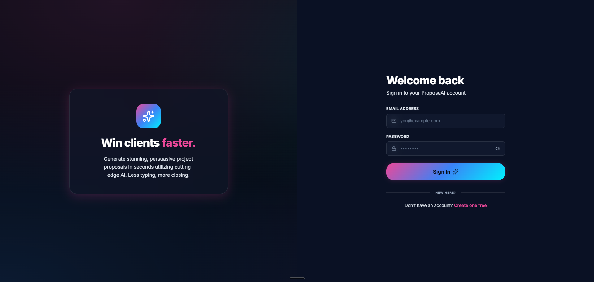
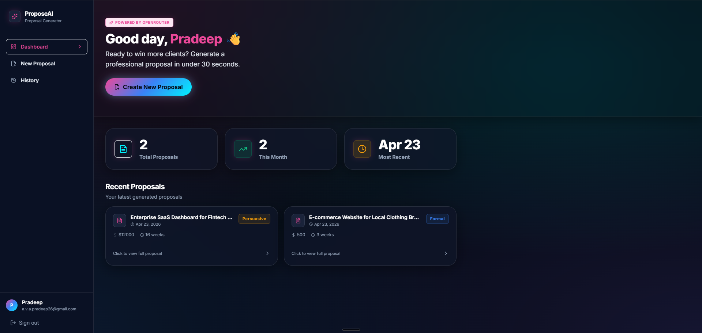
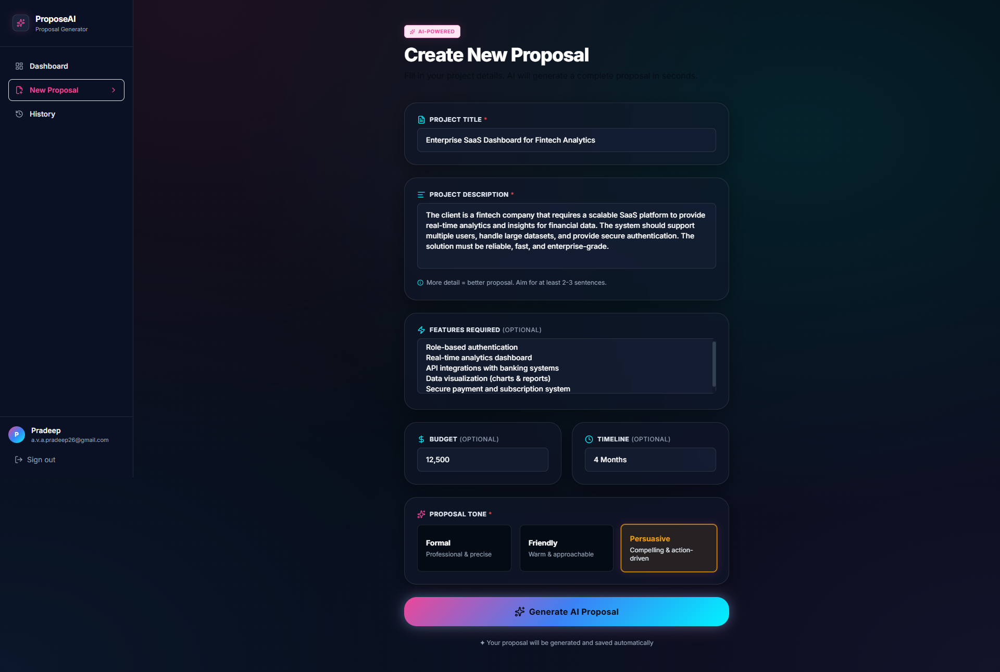
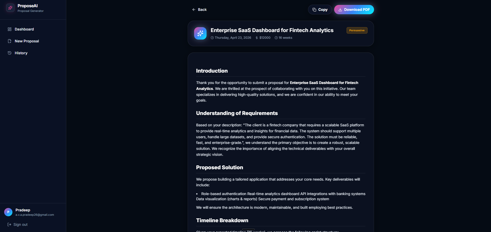
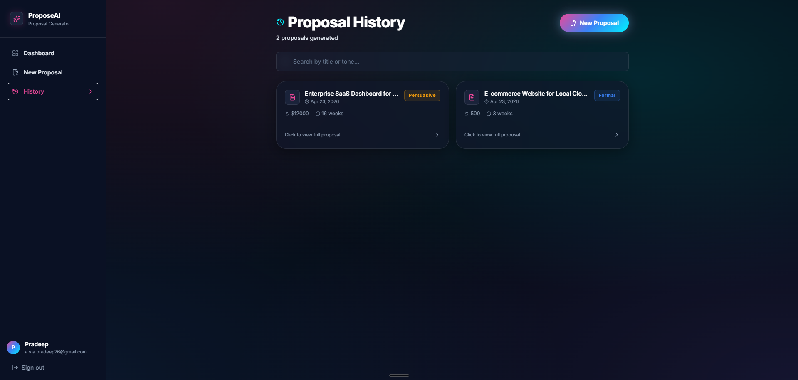

# 🚀 AI Client Proposal Generator

> Generate professional, client-ready proposals instantly using AI.

---

## 🌐 Live Demo

🔗 **Try it here:**
👉 https://ai-client-proposal-generator-ten.vercel.app

---

## 📌 Overview

**AI Client Proposal Generator** is a full-stack SaaS-style web application that helps freelancers, agencies, and developers generate high-quality client proposals in seconds.

Instead of manually writing proposals, users simply input project details — and the system generates a structured, professional proposal using AI.

---

## ✨ Features

* 🧠 AI-powered proposal generation
* 🔐 Secure authentication (Supabase)
* 📄 Structured output (Scope, Timeline, Pricing, Deliverables)
* 💾 User-specific proposal storage
* ⚡ Fast backend using FastAPI
* 🌐 Modern frontend with React (Vite)
* ☁️ Deployed on Vercel & Render
* 🔒 JWT-based authentication (Supabase Auth)

---

## 🖼️ Screenshots

> 📌 Place all images inside `/screenshots` folder

### 🔐 Login



---

### 🏠 Dashboard



---

### ✍️ New Proposal



---

### 📄 Generated Result



---

### 📚 Proposal History



---

## 🏗️ Architecture

```id="n0d3l9"
Frontend (Vercel - React)
        ↓
API Requests (Axios)
        ↓
Backend (Render - FastAPI)
        ↓
Supabase (Auth + Database)
        ↓
AI API (OpenRouter / LLM)
```

---

## ⚙️ Tech Stack

### Frontend

* React (Vite)
* Axios
* Supabase JS SDK

### Backend

* FastAPI
* SQLAlchemy
* Pydantic
* HTTPX

### Database & Auth

* Supabase (PostgreSQL + Auth)

### Deployment

* Vercel (Frontend)
* Render (Backend)

---

## 🔐 Authentication Flow

```id="v9a3kc"
User Login (Supabase)
        ↓
JWT Token Generated
        ↓
Frontend sends token (Authorization: Bearer)
        ↓
Backend verifies via Supabase API
        ↓
User-specific data access
```

---

## 🚀 Getting Started

### 1️⃣ Clone the repository

```bash id="7x1o2k"
git clone https://github.com/kxkxshi/AI-Client-Proposal-Generator.git
cd AI-Client-Proposal-Generator
```

---

### 2️⃣ Backend Setup

```bash id="q2w3e4"
cd backend
pip install -r requirements.txt
```

Create `.env`:

```env id="k9m8n7"
SUPABASE_URL=your_supabase_url
SUPABASE_ANON_KEY=your_anon_key
OPENROUTER_API_KEY=your_ai_key
DATABASE_URL=your_database_url
```

Run backend:

```bash id="z5x6c7"
uvicorn app.main:app --reload
```

---

### 3️⃣ Frontend Setup

```bash id="p0o9i8"
cd frontend
npm install
```

Create `.env`:

```env id="l1k2j3"
VITE_SUPABASE_URL=your_supabase_url
VITE_SUPABASE_ANON_KEY=your_anon_key
VITE_API_URL=http://localhost:8000
```

Run frontend:

```bash id="b4n5m6"
npm run dev
```

---

## 🌍 Deployment

| Service  | Platform |
| -------- | -------- |
| Frontend | Vercel   |
| Backend  | Render   |
| Database | Supabase |

---

## 📂 Project Structure

```id="x8c7v6"
backend/
 ├── app/
 │   ├── routers/
 │   ├── services/
 │   ├── models/
 │   ├── dependencies.py
 │   └── main.py

frontend/
 ├── src/
 │   ├── components/
 │   ├── pages/
 │   ├── api/
 │   └── lib/
```

---

## 🧠 Key Learnings

* Full-stack deployment (Vercel + Render)
* Secure authentication with Supabase (ES256 JWT)
* API integration and token-based security
* Debugging real-world production issues
* AI integration in web applications

---

## 🔮 Future Improvements

* 📄 Export proposal as PDF
* 📊 Proposal analytics dashboard
* 💳 Payment integration (Stripe)
* 📁 Proposal templates
* 📱 Mobile responsiveness

---

## 🤝 Contributing

Contributions are welcome!

```bash id="f7g8h9"
fork → clone → create branch → commit → push → PR
```

---

## 📄 License

This project is licensed under the MIT License.

---

## 👨‍💻 Author

**Pradeep A V A**

* GitHub: https://github.com/kxkxshi
* LinkedIn: *(add your link here)*

---

## ⭐ Show your support

If you like this project:

👉 Star this repo
👉 Share it
👉 Build on top of it

---

🚀 Built and engineered by Praxion Labs
